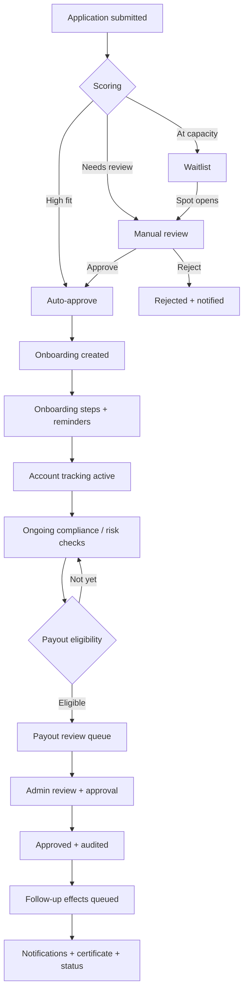
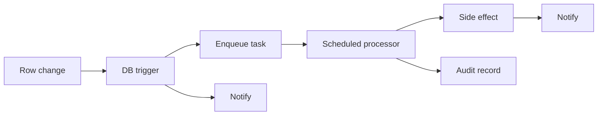
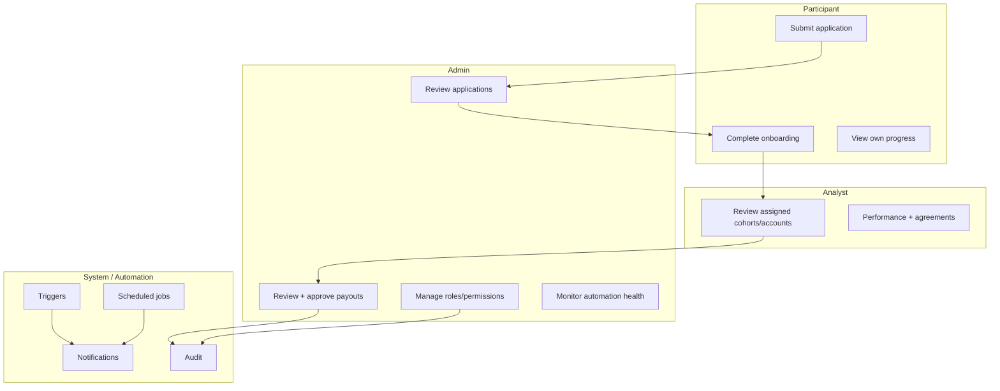
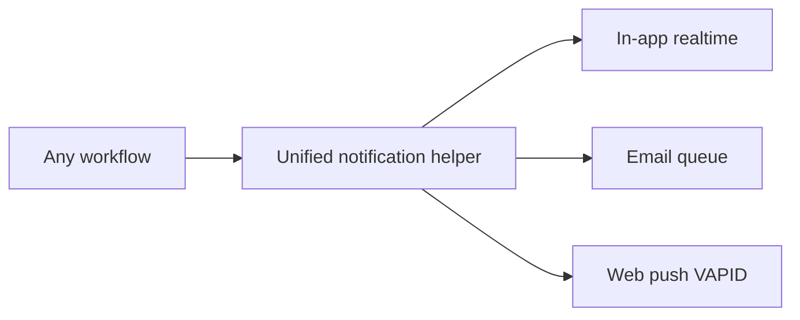
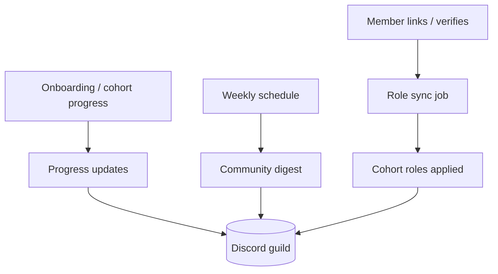

# BlixFlex — Workflow Map

> End-to-end map of the operational lifecycle and the automation that drives it.
> Rendered with Mermaid (GitHub renders these natively). Sanitized and illustrative.

## Lifecycle overview

## Automation pattern (applies throughout)

## Roles across the lifecycle

## Notification channels

## Community operations (Discord)

## Notes
- Diagrams describe the **shape** of the system, not exact production configuration.
- See [`../docs/workflow-automation.md`](../docs/workflow-automation.md) and
  [`../docs/architecture.md`](../docs/architecture.md) for detail.
